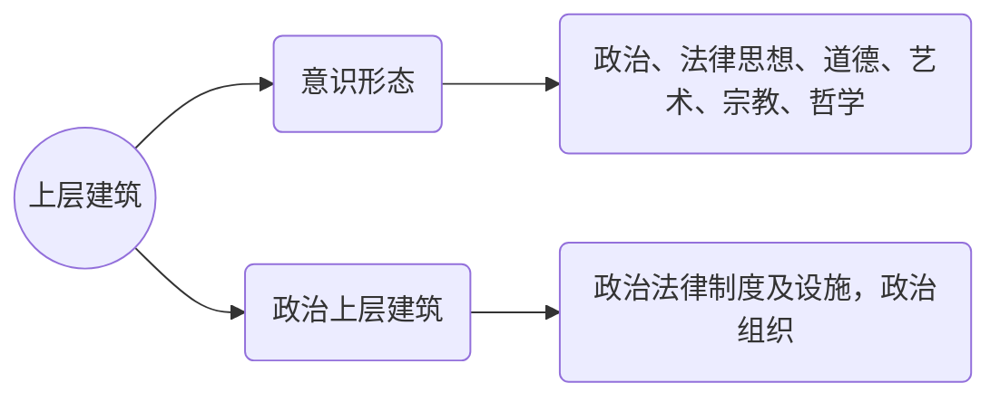
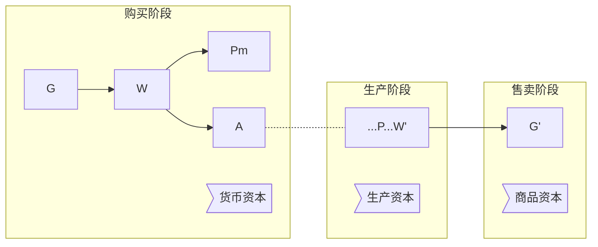

​	

<!-- more -->

### 零、绪论

#### 什么是马克思主义

##### 创造者

> 马克思主义是由马克思、恩格斯创立，由其后各个时代、各个民族的马克思主义者不断丰富和发展的观点和学说的理论体系。
>

##### 科学内容
> * 是关于自然、社会和人类思维发展的普遍规律的学说。
>* 是关于社会主义必然代替资本主义、最终实现社会主义的学说。
> 

##### 价值立场
> * 是关于无产阶级解放、全人类解放和每个人自由而全面发展的学说。
>* 是指引人民创造美好生活的行动指南。 

#### 马克思主义基本原理
##### 基本立场
> 以无产阶级的解放和全人类的解放为己任，以人的自由全面发展为美好目标，以人民为中心，一切为了人民，一切依靠人民。
>

##### 基本观点
> 是关于自然、社会和人类思维发展一般规律科学认识，是对人类思想成果和社会实践的科学总结。
>

##### 基本方法
> * 建立在辩证唯物主义和历史唯物主义世界观基础上的思想方法和工作方法
>* 实事求是的方法
> * 辩证分析法
> * 社会基本矛盾和主要矛盾分析法
> * 历史分析法
> * 阶级分析的方法
> * 群众路线的方法

#### 马克思主义产生的条件
> （历史条件、理论、自然科学前提、理论来源）
>
马克思主义是时代的产物
>
> * 社会经济基础
>   * 资产阶级革命和工业革命推动了社会生产力的大发展，资本主义社会阶级矛盾尖锐
> * 阶级基础
>   * 工人阶级逐渐登上了历史的舞台，阶级斗争 从自发到自觉阶段					 				 			 		
> * 科学基础
>   * 19世纪自然科学领域取得了三大成果：
>     * 细胞学说
>     * 能量转换与守恒定律
>     * 生物进化论
> * 理论依据
>   *  哲学，特别是德国古典哲学，是其直接理论来源，为他们 对现实问题的思考提供了最早的方法论。
>   *  政治经济学是英国经验主义文化的渗透，使得马克思主义成为科学和价值理论的统一。 

#### 马克思主义的发展 
1. 马克思恩格斯阶段  						  
>    * `马克思主义的创立时期，形成了唯物史观和剩余价值理论。`
>    * 共产党宣言》:唯物史观形成，马克思主义诞生的标志。  	
>    * 1867年《资本论》第一卷出版，剩余价值学说成熟。 
>    * 1875年《哥达纲领批判》、1880年《社 会主义从空想到科学的发展》，科学社会主义的完整形成。
>
2. 列宁和斯大林阶段
>    * `马克思主义的发展阶段，着重发展了无产阶级革命和解放的学说。`
>    * 揭示了帝国主义经济政治发展不平衡的规律， 突破了多国同时胜利论，创立了社会主义可以在一国首先取得胜利的理论 
>

3. 马克思主义中国化阶段
>    * `马克思主义的一般理论与中国具体实际相结合的过程。`
>    * 毛泽东思想
>      * 把马克思主义普遍原理与中国革命实际相结合，走农村包围城市的革命道路，确立了以新民主主义革命的理论为核心的毛泽东思想，建立了中华人民共和国。
>    * 邓小平理论
>      * 世界格局和时代主题的变化，在“结合”中实现了第二次飞跃，产生了邓小平理论，带领我们走中国特色社会主义道路，取得了重大胜利。
>    * "三个代表"重要思想
>      * 中国共产党带领中国人民坚持解放思想、实事求是、与时俱进，开创了中国特色社会主义事业的新局面
>    * 科学发展观
>      * 进一步指明了中国现代化建设的发展道路、发展模式和发展战略，是马克思主义的世界观和方法论在发展问题上的集中体现。 

#### 马克思主义的特征

> 1. 科学性：马克思主义是对自然、社会和人类思维发展的本质和规律的正确反映。
> 2. 革命性：表现在它的彻底的批判精神和鲜明的无产阶级立场。
> 3. 实践性：马克思主义是从实践中来，到实践中去，在实践中接受检验，并随实践不断发展的学说。
> 4. 人民性：人民至上是马克思主义的政治立场，一切奋斗都致力于实现最广大人民的根本利益。
> 5. 发展性：马克思主义是不断发展的学说，具有与时俱进的品质。

#### 为什么要学习马克思主义和如何学习马克思主义
> * 观察当代世界变化的认识工具
> * 指引当代中国发展的行动指南
> * 引领人类社会进步的科学真理

##### 如何学习
> * 努力学习和掌握马克思主义的基本立场、观点、方法。
> * 坚持理论联系实际的马克思主义学风。
> * 自觉将马克思主义内化于心、外化于行。

---

### 一、世界的物质性及发展规律

#### 世界观、哲学以及哲学的基本问题 

##### 哲学
>* 哲学是关于世界观的学问，是系统化、 理论化的世界观
>* 哲学是自然知识、社会知识和思维知识 的概括和总结
>* 哲学是关于整个世界最普遍本质和规律 的学科
>* 哲学既是世界观又是方法论。

##### 哲学基本问题
>* 思维和存在的关系问题
>  * 思维和存在谁是世界的本原
>  * 思维能否反映存在，世界是否统一

#### 什么是物质、意识 

>物质是标志客观实在的哲学范畴，这种客观实在是人通过感觉感知的，它不依赖于我们的感觉而存在，为我们的感觉所复写、摄影、反映

##### 意识
>意识是人脑的机能， 是客观世界的主观映像
>
>* 意识在内容上是客观的，在形式上是主观的; 意识是物质的产物， 但又不是物质本身
>
>* 意识物质世界长期发展的产物
>
>* 意识是社会的产物

#### 世界的物质统一性
>* 意识统一于物质
>
>* 人类社会也统一于物质
>  * 人类社会是物质世界的组成部分
>  * 人类获取生活资料活动是物质性的活动
>  * 人类社会存在和发展的基础是物质资料的生产方式

#### 物质与运动、相对静止

##### 运动的定义
> 运动，就是最一般意义、存在方式，物质的固有属性来说，它包括宇宙中发生的一切变化和过程，从单纯的位置移动起直到思维。
>
> * 运动绝对，静止相对
>
> * 静止是事物存在和发展的必要条件，是人们认识事物的必要前提，是测量和计算运动的尺度

#### 物质运动与时间空间、时间与空间的特性 

时间: 	物质运动的持续性、顺序性 
>* 所谓持续性，是指任何一个物体的运动都要经历一 个或长或短的过程。  
>* 所谓顺序性，是指不同事物之间运动过程的出现有 一个先后顺序关系。 
>* 时间的特性是一维性，即时间只有一个方向，具有不可逆性。
>

空间:	运动着的物质的广延性或伸张性，指物体的位置、规模和体积
>* 三维性

#### 社会生活在本质上是实践的 

##### 实践的基本特点：
>1. 客观性
>2. 自觉能动性
>3. 社会历史性
>

##### 社会生活在本质上是实践的：
>* 实践是社会关系形成的基础
>* 实践形成了社会生活的基本领域
>* 实践是人类社会发展的动力源泉   

#### 客观规律性和主观能动性、意识的能动作用

##### 主观能动性和客观规律的统一
>* 尊重客观规律是正确发挥主观能动性的前提
>* 只有充分发挥主观能动性，才能正确认识和利用客观规律
> * 从实际出发是正确发挥人的主观能动性的前提。
> * 实践是正确发挥人的主观能动性的基本途径。
> * 发挥人的主观能动性，还需依赖一定的物质条件和物质手段。

##### 意识对物质具有反作用
>* 意识活动的目的性和计划性
>* 意识活动的能动创造性
>* 意识活动指导实践，改造世界
>* 意识活动具有指导、控制人的行为和生理活动的作用。  					 				 			 		

---

### 二、辩证法

#### *形而上

> 在绝对不相容的对立中的思维(是非分明)

#### 联系及其特性

>联系是事物或现象之间 及其内部诸要素之间相 互作用、相互影响和相互制约的种种关系
>* 客观性
>* 普遍性
>* 多样性
>* 条件性
>
>联系的哲学意义：
>* 任何事物都不是孤立存在的
>* 一切以条件、地点和时间为转移

#### 发展的实质
>发展:前进的上升的运动，是由一种质态向另一种质态的飞跃。
>
>实质:新事物的产生和旧事物的灭亡
>
>* 新事物：合乎历史前进方向，具有远大前途的东西
>* 旧事物：丧失历史必然性，日趋灭亡的东西

#### 辩证法三大规律
> 1. 对立统一规律：唯物辩证法的实质和核心
>    * 揭示了事物联系的根本内容和发展动力，从根本上回答了事物为什么发展的问题
>    * 贯穿唯物辩证法其他规律和范畴的中心线索，是理解其它规律的要素
>    * 还是人们认识世界改造世界的根本方法：矛盾分析法
> 2. 质量互变规律
> 3. 否定之否定规律

#### 矛盾同一性和斗争性及其关系、方法论意义，矛盾同一性和斗争性在事物发展中的作用

##### 矛盾及其属性
>事物之间或事物内部各要素之间的既对立 又统一的关系 
>
>* 同一性(相对/有条件)：矛盾双方相互依存、相互贯通、相互作用的性质和趋势
>* 斗争性(绝对/无条件)：矛盾双方的相互排斥、相互冲突、相互否定、相互分离的性质和趋势 
>
>* 矛盾的同一性和斗争性是相互统一又相互联系的
>

##### 矛盾在事物发展中的作用
>* 矛盾双方的相互依存是事物存在的前提
>* 矛盾双方相互吸收有利于自身的因素得到发展
>* 矛盾双方的相互贯通规定事物发展的基本趋势
>* 矛盾的斗争性促使矛盾双方的力量消长，推动事物不断地量变
>* 矛盾的斗争性引起矛盾双方的转化，推动事物发生质变

#### 矛盾的普遍性特殊性

##### 普遍性
>*  其一，矛盾存在于一切事物的发展过程中，即事事有矛盾
>*  其二，每一事物的发展过程中存在着自始至终的矛盾运动，即时时有矛盾
>

##### 特殊性
>* 不同事物的矛盾各有其特点。客观物质世界矛盾运动形式是无限多样的，因而不同事物的矛盾各有其特殊性
>* 同一事物的矛盾在发展的不同过程个阶段上各有不同的特点
>* 是构成事物的诸多矛盾以及每一矛盾的不同方面各有不同的性质。即矛盾地位的特殊性

#### 矛盾的普遍性特殊性的辩证关系及方法论意义
> * 矛盾的普遍性即矛盾是`共性`，矛盾的特殊性即矛盾的`个性`。矛盾共性是无条件的绝对的，矛盾特殊性是有条件的相对的
>
> * 任何事物都是共性和个性的统一体，共性寓于个性之中，没有离开个性的共性，也没有离开共性的个性。

#### 主要矛盾和非主要矛盾、矛盾主要方面和非主要方面

#### 对事物发展的不同阶段而言：

##### 主要矛盾
>处于支配地位的、对事物的发展起决定作用的矛盾，由于它的存在和发展，规定和影响着其它矛盾的存在和发展
>

##### 非主要矛盾
>是处于从属地位、对事物的发展不起决定作用的矛盾。  	
>

#### 对每一矛盾内部的对立双方而言
矛盾的主要方面：矛盾双方中起着主导作用，规定事物的性质
>
矛盾的次要方面： 矛盾双方中处于被支配地位的方面

#### 量变与质变及其关系
>质：事物区别于其他事物的内在规定性
>
>量：事物的规模等关系表现的外在规定性
>
>度：保持物质稳定的数量界限
>
>质变：物质根本性质的变化
>
>量变：事物数量及组成在空间上的变化
>

##### 量变和质变的辩证关系
>* 量变是质变的必要准备
>* 质变巩固量变的成果并为新量变开辟新量变开辟新的道路
>* 量变和质变相互渗透

#### 辩证的否定及其方法论意义
>否定之否定揭示了事物发展前进性和曲折性的统一
>
>肯定是指事物保持自身存在的因素
>
>否定是指事物自身趋向灭亡、并转化为他事物的因素
>

#### 辩证的否定
>* 辩证的否定是事物的自我否定
>* 辩证的否定是事物发展的环节
>* 辩证的否定是事物联系的环节
>* 辩证否定的实质是扬弃 

#### 客观辩证法和主观辩证法

##### 客观辩证法
>是指客观事物或客观存在的辩证法，即客观事物及其相互作用、相互联系的形式呈现出的各种物质形态的辩证运动和发展规律
>

##### 主观辩证法
>是指人类认识和思维运动的辩证法。即以概念作为思维细胞的辩证思维运动和发展的规律

#### 唯物辩证法的五对基本范畴

>* 原因与结果：客观性、本质性、先后性
>* 可能性与现实性
>  * 凡是现实的都是合必然性之理的， 凡是合必然性之理的都是现实的 
>  * 可能性从内部而言，是由必然性所决定的，从外部而言，又受偶然性制约 
>* 内容与形式
>* 现象与本质
>* 必然性与偶然性
>  * 必然性体现事物发展过程中确定不移的趋势 
>  * 偶然性体现事物发展过程中不确定的趋势

---

### 三、真理与价值

#### 实践与认识的关系
>实践是认识的基础，认识从实践产生，为实践服务，随实践发展，受实践检验
>* 实践产生了认识需要
>* 实践为认识提供了可能
>* 实践使得认识得以产生和发展
>* 实践是检验真理的唯一标准，一切真知都来自于实践

#### 认识的本质和发展规律

##### 认识的本质
>主体对客体的能动反映
>
>* 主体：有思维能力，从事社会实践和认识活动的人
>* 客体：实践和认识活动所指向的对象
>* 中介：各种形式的工具、手段以及运用、操作这些工具的程序和方法
>

##### 认识运动的基本规律
>实践、认识、再实践、再认识，这种形式，循环往复以至无穷，而实践和认识之每循环的内容，都比较地进到了高一级的程度。
>
```flow
st=>operation: 实践
op1=>operation: 认识
op2=>operation: 实践

st->op1->op2
op2->op1

```

#### 感性认识和理性认识

##### 感性认识
>是客观事物作用于人的感官而 引起的一种最简单的反映形式，是对客观事物表面的个别属性、个别特征的反映
>

##### 理性认识
>是对同类事物共同的一般特性和本质属性的概括的反映 

#### 真理及其客观性

##### 真理的含义
>真理是标志主观与客观相符合的哲学范畴，是人们对客观事物及其规律的正确反映
>

##### 真理的客观性
>* 真理的内容是客观的
>* 检验真理的标准是客观的

#### 真理的绝对性和相对性

#####  真理的绝对性
>真理的绝对性是指人们对客观事物及其规律的正确认识具有确定性、无条件性 
>
>* 任何真理都包含着同客观对象相符合的客观内容，这是无条件的、绝对的
>* 人类按其认识本性能够正确认识无限发展的客观世界，这是无条件的、 绝对的
>

##### 真理的相对性
>* 从认识广度看，任何真理都是对物质世界发展的某一阶段、某一部分的正确认识
>* 从认识的深度看，任何真理都是对物质世界的某一层次、某一方面的认识
>

##### 真理的绝对性和相对性的辩证关系
>对立:真理的绝对性和相对性是任何一个真理的两个不同的属性，绝对性主要是指真理的客观性，相对性主要是指真理的条件性
>统一:两者相互渗透、相互包含;相对真理不断向绝对真理转化
>意义:坚持真理观上的辩证法，反对绝对主义和相对主义; 确立对待马克思主义的科学态度			 		

#### 真理的检验标准

>实践是检验真理的唯一标准 

#### 真理和价值的关系

##### 价值
>揭示外部世界对于满足人的需要的意义的哲学范畴，指具 有特定属性的客体对于主体需要的意义，即客体的积极作用
>
>价值和真理在实践中辩证统一
>
>* 成功的实践必然以真理和价值的辩证统一为前提
>* 价值的形成和实现以坚持真理为前提，而真理又必 然具有价值
>* 真理和价值在实践和认识活动中相互制约、相互引导、相互促进

---

### 四、社会历史的本质与规律与社会发展动力系统

#### *历史
> * 人与自然之间物质交换的过程
> * 人类社会发展的历史就是资料生产的历史
> * 历史也是一步思想史的展开和延续

#### 物质资料的生产方式是人类社会发展的决定力量

>​	

#### 社会存在和社会意识的辩证关系

##### 社会存在
>社会生活的物质方面，主要指物质生活资料的生产方式，也包括地理环境和人口因素
>

##### 社会意识
>社会生活的精神方面

##### 社会存在和社会意识的辩证关系
>* 	社会存在决定社会意识
>  * 社会存在决定社会意识的客观内容
>  * 社会存在的发展变化，决定社会意识的发展变化
>
>* 社会意识具有相对独立性
>  * 社会意识与社会存在发展的不平衡性
>  * 社会意识在自身的发展中具有历史继承性
>  * 社会意识各种形式之间相互影响和相互作用
>  * 社会意识对社会存在具有能动的反作用
>

##### 社会存在和社会意识的辩证关系原理的意义
>* 第一次正确解决了社会历史观的基本问题，是社会历史观革命性变革的基础	
>* “两个划分”——从社会生活和各种领域划分出经济领域，从一切社会关系中划分出生产关系
>* "两个归结”——将一切社会关系归结于生产关 系，将生产关系归结于生产力发展

#### 社会基本矛盾是社会发展的根本动力，生产力是社会发展的最终的决定力量

##### 社会基本矛盾
>生产力和生产关系、经济基础和上层建筑的矛盾
>

##### 生产力
>人类在生产实践中形成的改造和影响自然以使其适合社会需要的物质力量
>
>* 性质：客观现实性、社会历史性
>* 基本要素：劳动力资料、劳动对象、劳动者
>* 科学技术是第一生产力
>

##### 生产关系
>人们在物质生产过程中形成的不以人的意志为转移的经济关系
>

#### 生产力是社会发展的决定性力量
>* 生产力是社会基本矛盾运动中最基本的动力因素，是人类社会发展和进步的最终决定力量
>* 社会基本矛盾特别是生产力和生产关系的矛盾，是“一切历史冲突的根源”，决定着社会中其他矛盾的存在和发展
>* 社会基本矛盾具有不同的表现形式和解决方 式，并从根本上影响和促进社会形态的变化和发展

#### 生产力和生产关系矛盾运动的规律

>1. 生产力决定生产关系
>   * 生产力状况决定生产关系的性质
>   * 生产力的发展决定生产关系的变革
>2. 生产关系对生产力的反作用
>   * 当生产关系适应生产力状况时，它对生产力的发展起促进作用
>   * 当生产关系不适合生产力状况时，它对生产力的发展起阻碍作用
>3. 生产力和生产关系的相互作用构成生产方式的矛盾运动
>

##### 生产力和生产关系矛盾运动的规律的意义
>*  首先，这一原理在人类思想史上彻底否定了以 “道德说教”作为评判历史功过是非的思想体系， 第一次科学地确立了生产力发展是“社会进步的最 高标准”。
>*  其次，这一规律是马克思主义政党制定路线、 方针和政策的重要依据

#### 经济基础和上层建筑的矛盾运动规律

##### 经济基础
>由社会一定发展阶段的生产力决定的生产关系总和
>
>* 经济基础的实质是社会一定发展阶段的基本经济制度，是制度化的物质社会关系
>* 经济基础与经济体制具有内在联系

##### 上层建筑
>建立在一定经济基础上的意识形态级相应的制度、组织和设施



##### 矛盾规律
>* 经济基础决定上层建筑
>* 上层建筑反作用于经济基础

#### 社会形态更替的一般规律

社会形态：同生产力发展到一定阶段相适应的经济基础与上层建筑的统一体
>* 经济形态
>* 政治形态
>* 意识形态
>

##### 社会形态更替的统一性和多样性
>* 统一性
>  * 原始社会 奴隶制社会 封建制社会 资本 主义社会 共产主义社会
>
>* 多样性
>  * 每个国家或民族有其各自的发展历程
>
>---
>
>社会形态更替的必然性和人们的历史选择性
>
>* 社会形态更替的必然性
>  *  社会形态依次更替的过程和规律是客观的，其发展的基本趋势是确定不移的
>* 人们的历史选择性
>  * 社会发展的客观必然性为人们的历史 选择提供了基础、范围和可能性空间
>  * 社会形态更替的过程是一个合目的性与合规律性相统一的过程
>  * 人们的历史选择性，归根结底是人民群众的选择性。  					 				 			 		

#### *历史进步的尺度

> * 历史进步的终极尺度是生产力的发展
> * 历史进步的终极尺度是人的发展
> * 是生产力发展与人的发展的统一

#### *资本主义发展的三个悖论

> * 环境悖论
>   * 掠夺更多的自然资源和消费更多的商品成为资本逻辑的两大支点
>   * 通过消费的扩张来保证经济的持续增长，这种消费也就主要不是满足需要的活动，而是变成了对剩余产品的消耗和毁灭活动
>
> * 两级悖论
>   * 贫富两极分化
>
> * 存在悖论
>   * 资产阶级工人存在悖论：物的世界的增值同人的世界的贬值成正比

#### *阶级斗争

> 阶级间物质利益根本对立，根源于社会经济关系的冲突，导致阶级间的对立与冲突

#### 科学技术在社会中的作用

>科学：反映事物本质及规律的知识体系
>
>技术：
>
>* 广义：为达目的而利用、改造世界的手段方法
>* 狭义：生产技术，表现为生产过程中对活动的控制操作手段、程序和方法
>
>科学技术革命是推动经济和社会发展的强大杠杆
>
>科学技术对社会作用
>
* 科学技术通过促进经济和社会发展造福于人类。大大增强了人类改造自然的能力,它对社会发展的积极作用是主要的、基本的方面 
>* 另一方面同时也意味着科学技术增强了人类破坏自然的能力，也产生一定的消极后果

#### 人民群众是历史的创造者

##### 人民群众
>* 人民群众是指一切对社会历史发展起推动作用的人们，是社会成员的大多数
>
>* 在阶级社会中，它包括一切对历史发展起着促进作用的阶级、阶层和社会集团
>
>* 人民群众这个概念在不同的国家和各个国家的不同历史时期，有着不同的内容
>

##### 人民群众创造历史的决定作用表现
>* 人民群众是社会物质财富的创造者
>* 人民群众是社会精神财富的创造者
>* 人民群众是社会变革的决定性力量
>

##### 人民群众创造历史的制约条件
>* 客观经济条件：主要指生产力和生产关系
>* 政治条件：主要指政治和法律制度
>* 精神条件：主要指传统，既存的各种思想观念、思维习惯、价值观念等

#### 杰出个人的作用

>个人是指在社会群体中单个的成员，是社会 的一个“分子”
>
>* 普通个人
>* 历史人物
> * 杰出人物：反映时代要求、推动历史进步，并在历史进程中留下深刻印记的 正面人物
>   * 杰出的政治家、军事家、思想家、科学家、艺术家
>

#### 杰出个人作用
>* 进步历史事件当事人和发起者
>* 实现历史任务的组织者和领导者
>* 真理的探索者和发现者
>

##### 历史性人物制约性
>* 时势召唤英雄 
>* 时势锻炼英雄
>* 时势筛选英雄
>

#### 普通个人的作用(平行四边形原理)
>"无数互相交错的力量， 有无数个力的平行四边形，由此就产生出一个 合力，即历史结果”。“每个意志都对合力有所贡献，因而是包括在这个合力里面的
>
>* 创造历史的参与者
>* 杰出人物是普通人发展而来的
>* 现代普通人可能对历史发生"超常性影响"

#### 唯心史观的局限

>* 考察人们参加历史活动的思想动机，而没有揭示这些思想动机背后的物质动因
>* 忽视人民群众的作用

#### *评价历史人物

> * 历史分析法
> * 阶级分析法

#### 杰出个人和人民群众作用的关系

>​	

---

### 五、商品劳动价值论

####  自然经济和商品经济，商品经济产生的条件

>商品经济：以交换为目的的经济形态
>

#####  商品经济存在和发展的条件
>* 前提条件：社会分工
>* 根本条件：不同经济利益的生产者
>
>自然经济：自给自足，满足本经济单位的需要的家庭生产为基础的生产方式
>

#### 商品
>使用价值+价值+劳动产品+用于交换

####  商品的价值和使用价值，以及交换价值，具体劳动和抽象劳动

>使用价值：物品能满足人们某种需要的属性，是商品的`自然属性`
>
>* 必须是为满足`别人`需要的使用价值
>* 必须是`为交换而生产`的使用价值
>* 商品的使用价值体现在商品的属性
>* 商品使用价值在`消费过程`中体现
>* 一种商品有多种使用价值
>
>价值(<span style="color:red">交换价值的基础</span>)：物化在商品中的一般人类劳动，是商品的`社会属性`
>
>使用价值和价值
>
>* 对立性：两者不可兼得
>* 统一性：商品必须同时具有使用价值和价值
>
>交换价值(<span style="color:red">价值的表现形式</span>)：一种使用价值与另一种使用价值交换量的关系
>
>* 使用价值是交换价值的物质承担者
>
>具体劳动：劳动的具体形式
>
>抽象劳动：无差别人类劳动
>
>具体劳动和抽象劳动是同一劳动的不同方面

####  商品的价值量，社会必要劳动时间，简单劳动和复杂劳动

>**价值量**：凝结在商品中的抽象劳动量
>
>* 不是个别劳动时间决定，由社会必要劳动时间决定
>
>**个别劳动时间**
>
>​	个别商品生产者或个别企业生产某种商品的劳动时间
>
>**社会必要劳动时间**
>
>​	在现有的社会正常的生产条件下，在社会平均的劳动熟练程度和劳动强度下制造某种商品所需要的劳动时间
>
>**简单劳动**
>
>​	指在一定社会条件下，不需要经过任何专门的训练，一般劳动者都能胜任的劳动，即简单劳动力的支出和耗费
>
>**复杂劳动**
>
>​	指具有一定技术专长的劳动，而获得这些技术专长和知识，需要经受专门的培养和训练
>
>* 少量的复杂劳动等于多量的简单劳动

####  商品价值形式的四个阶段，货币的本质以及职能，价值规律及其作用

>**价值规律**
>
>- 商品价值量由社会必要劳动时间决定，商品交换要以价值量为基础等价交换
>
>**价值规律的作用**
>
>* 自发地调节资源在社会各部门的配置
>* 自发的刺激社会生产力发展
>* 自发地调节社会收入的分配
>
>**价值规律的消极后果**
>
>* 可能导致垄断的发生
>* 可能引起商品生产者两极分化
>* 可能造成社会资源浪费
>
>`价值形式`：商品的价值表现形式，当货币出现后，表现为价格，`平均长期来看，商品与价值一致`
>
#### **价值形式的四个阶段**(揭示价值的本质是一种社会关系)
>**一、简单价值形式**
>
>​	一种商品价值通过任何另一种商品来表现
>
>**二、扩大的价值形式**
>
>​	一种商品价值通过一系列简单价值形式的总和构成
>
>**三、一般价值形式**
>
>​	通过一般等价物比较价值
>
>**四、货币形式**
>
>​	货币固定为一般等价物
>
* ##### 货币的本质
>  * 特殊的商品
>  * 价值：商品价值的直接代表
>  * 使用价值：`自然属性`和`社会职能`决定的使用价值
>
* ##### 货币的职能
>  * 价值尺度：能表现一切商品的价值
>  * 流通手段：直接交换一切商品的能力
>  * 贮藏手段
>  * 支付手段：信用交易相关
>
>* 一定时间内流通货币量规律
>
>* $流通中所需的货币量 = \frac{商品价格总额}{货币流通速度}$
>
>* 商品价格总额=待流通商品数量 * 商品价格水平
>
> * 货币流通速度=同一单位货币的平均流通次数

####  以私有制为基础的商品经济的基本矛盾

>私人劳动和社会劳动的矛盾构成基本矛盾
>
>* 决定商品经济的本质及发展过程
>* 商品经济其他一切矛盾的基础
>* 决定生产者的命运

####  劳动价值论的意义

>1. 劳动价值论，为剩余价值论的创立奠定了理论基础;
>
>2. 劳动价值论揭示私有制下商品经济的基本矛盾，为从 物与物的关系背后揭示人与人的关系提供了理论依据
>
>3. 劳动价值论揭示的商品经济的一般规律，为分析现代社会市场经济发展提供理论指导 

#### 深化对马克思劳动价值论的认识

> * 深化对创造价值的劳动的认识，对生产性劳动做出新的界定。 
>   * 应当在理论上充分肯定生产性劳动应当包括大部分非物质生产领域的 服务性劳动，服务性劳动也是创造价值的劳动，以利于推动第三产业 更快发展。 
>
> * 深化对科技人员、经营管理人员在社会生产和价值创造中的作用 的认识。 
>
> * 深化对技术、知识、信息等新的生产要素在财富和价值创造中的 作用的认识。 
>
> * 深化对价值创造与价值分配关系的认识。价值分配不仅以价值创 造为前提，而且由生产资料所有制关系决定 

####  资本主义产生的两个途径

>* 小商品经济分化而来
>* 商人和高利贷者转化而来

####  资本原始积累的两个途径

>暴力掠夺生产者，使生产资料和劳动者分离，资本货币在资本家手中迅速积累
>
>* 海外殖民掠夺
>* 圈地运动(掠夺农民土地)
>* * 利用国家政权，发行公债，增加捐税等手段敛财

#### 剩余价值理论及其意义

> **剩余价值论**：资本主义经济的特殊规律
>
> **意义**
>
> * 深刻的揭露了资本主义生产关系的剥削本质，阐明了资产阶级与无产阶级斗争的经济根源，指出无产阶级革命的必然性
>* 是马克思主义经济理论的基石，是无产阶级反对资产阶级、揭示资本主义剥削制度的锐利武器
> * 由于唯物史观和剩余价值理论，社会主义由空想变为科学

#### 必要劳动、剩余劳动

> 必要劳动：与劳动力价值相匹配的劳动部分
>
> 剩余劳动：无偿为资本家创造的价值的劳动部分

####  劳动力成为商品的条件，劳动力商品的特点与货币转化为资本

>**资本流通公式**
>
>G-W-G'
>
>**劳动力**：人的劳动能力，是存在于人体内部的脑力和体力的总和
>
>**劳动力成为商品的条件**
>
>* 劳动者具有人身自由：`能将自身劳动作为商品支配`
>* 劳动者一无所有：`无实现劳动的物质条件`
>
>**劳动力商品**
>
>不仅能创造价值，而且能创造比自身价值更大的价值
>
>**货币转换为资本**
>
><span style="color:red">前提：</span>劳动力成为商品
>
><span style="color:red">标志：</span>剩余价值生产

#### 不变资本、可变资本，剩余价值和剩余价值率，剩余价值的生产方法，超额剩余价值

>不变资本：只发生价值转移(`生产资料`)
>
>可变资本：能使价值增殖(`劳动力`)
>
>剩余价值：$\Delta G= G' - G$(`剩余劳动的凝结`)
>
>剩余价值率：$\frac{剩余劳动时间}{必要劳动时间}=\frac{剩余劳动}{必要劳动}$
>
>* 反映资本对雇佣劳动的剥削程度
>
>剩余价值的生产方法
>
>* `绝对剩余价值生产`
>* `相对剩余价值生产(超额剩余价值)`
>
>超额剩余价值：
>
>* 提高生产率，个别劳动价值 < 社会劳动价值

#### 资本积累，资本的有机构成，资本主义相对人口过剩

>资本的积累：剩余价值的资本化(`两级分化与失业的源泉`)
>
>资本的有机构成：由资本技术决定并反映`技术构成`变化的资本`价值构成`
>
>相对人口过剩：失业

#### 资本的循环周转和再生产、产业资本循环的三个阶段

>购买阶段、生产阶段、售卖阶段



#### 产业资本运动的两个前提条件

>* 空间并存
>* 时间接续

#### 社会总产品，社会生产的两大部类

>c：生产资料的转移价值
>
>v：必要劳动创造的价值
>
>m：剩余劳动时间中创造的价值
>
>社会总产品：社会在一定时期创造生产资料总和
>
>* 价值构成
> * c+v+m
>* 实物构成
> * 生产资料
> * 消费资料
>
>---
>
>**社会生产两大部类**
>
>`生产资料的第一部类I`：由生产生产资料的部门构成，产品进入生产领域
>
>`生产资料的第二部类II`：由生产消费资料的部门构成，产品进入消费领域

#### 资本主义工资的本质，利润和利润率

>**工资**
>
>* 劳动力商品的价值表现
>
>**利润**：剩余价值的转化形式，剩余价值是利润的本质
>
>**利润率**：$p' = \frac{m}{c+v}$

#### 资本主义社会的基本矛盾与经济危机

> `资本主义基本矛盾`
>社会化生产力与资本主义私人占有生产关系之间的矛盾 
>
> `资本主义经济危机`
>
>**本质**：生产过剩(`相对过剩，对劳动人民支付能力而言过剩，而不是需求过剩`)
>
>**根源**：资本主义的基本矛盾
>
>* 生产无线扩大的趋势与劳动人民有支付能力的需求相对缩小的矛盾
>* 单个企业内部生产的有组织性和整个社会的无政府之间的矛盾
>
>**表现**：资本再生产呈现周期性
>
>* 危机 => 萧条 => 复苏 => 高涨
